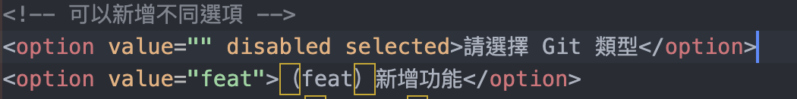
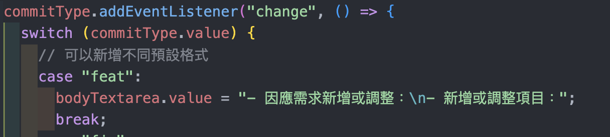

# [Git commit 產生器](https://minglin1995.github.io/Git-Tool/index.html)

1. 因為公司有 Git Commit Message 格式規範，所以就做一個方便使用的工具
2. 可以自行取用修改，記得轉換為 JS ~

### 修改方法

1. 修改 index.html ，新增或修改選項 option 
2. 修改 main.ts ，新增或修改對應的 case 
3. 轉換為 JS
   ```
   tsc --target es6 main.ts
   ```
